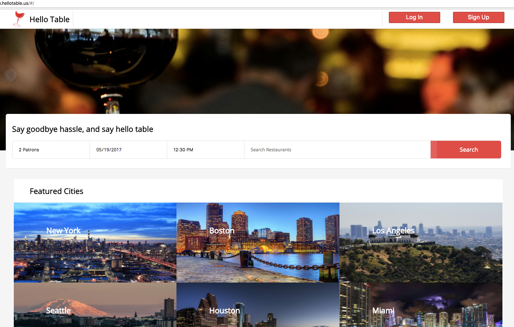
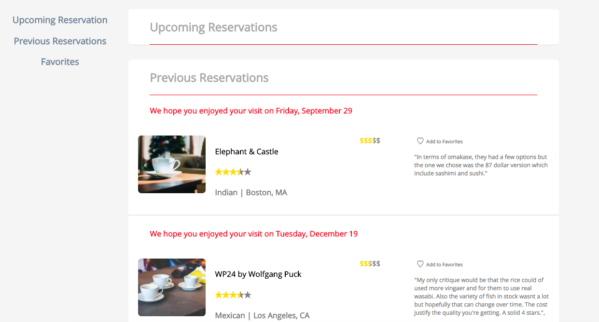
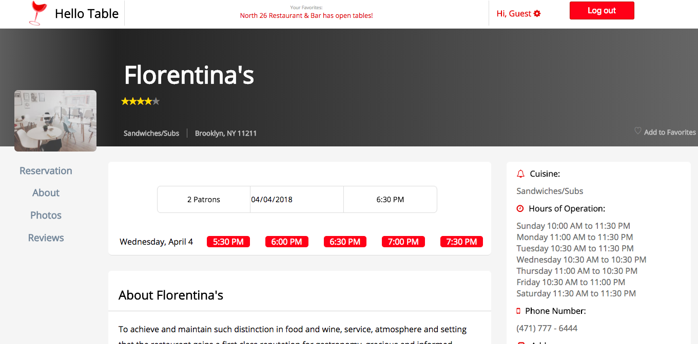

## General Description

[HelloTable](https://hellotable.herokuapp.com/#/) is an HelloTable inspired clone where a user can browse, search, and view restaurants. If a user likes what they see, a reservation can be made.

## Features

* Searches can be executed according to city or restaurant name - near matches will appear as suggestions. Featured cities will appear on a front page splash.
* Browsing by city will bring up a list of all restaurants in the vicinity. Each restaurant is separated into its own snippet and users can view the full restaurant details through links.
* Restaurant show pages will show off details of the restaurant - description, photos, mapped location, etc.
* Restaurant show pages will generate available reservations near the time and seating arrangement specified in a search. Or, if the the restaurant was navigated to via browsing, available reservations will be generated according to the current time.
* Restaurants can be created by users who are logged in.
* Restaurants can be created with multiple images for the details page.
* Restaurants can be edited by the creating user through the manager page.

## Tech and Implementation

* HelloTable was created using a Ruby on Rails backend with React handling front end components and Redux managing data.
* Build tools include webpack for bundling and babel for transpiling.
* Smooth scroll with anchor links was achieved with the use of react-scrollchor.
* Side navbars use react-sticky for onScroll event.

## File Structure

* Backend components are broken down into Models, Controllers, and Views and can be found in /app.
* Frontend components are broken down into Actions, Components, Reducers and can be found in /frontend.
* Database information kept in /db.
* CSS in /app/assets/stylesheets.

### Database

* HelloTable's backend is comprised of five distinct tables - Users, Cities, Restaurants, Reservations, and Photos. Each city has associations to restaurants for easy browsing from the city show page and simplified searching from the the home page.
* Restaurants can be added by users so access to editing is restricted to the user who added the restaurant.
* Reservations have associations to users who made the reservation and restaurants to which the reservations belong.
* Photos have been separated out into it's own table and have an association to a restaurant.

### Sessions

* Sessions are handled with backend auth using BCrypt for password encryption and SecureRandom for session tokens
* Front end auth maintains a user's logged in status.

### Users

* Users must log in to view the profile page, add restaurants, create and cancel reservations, or edit restaurant.
* On the user profile page, users can view and cancel upcoming reservations as well as view previous reservations.
* Logged in users can leave reviews for completed reservations.
* From the front page, users navigate to a form where they can add restaurants (if logged in).

### Restaurants

* Restaurants can be added by any user. Once created, restaurants are fairly static items.
* Each user can manage/edit one restaurant at a time.
* Restaurants can be found by browsing through the catalog of using the search feature on either the home page or the city show page.
* Restaurant show page displays restaurant details along with associated photos.
* Show page also has quick links set to reasonable defaults for convenient reservations as well as a search bar for custom reservations.
